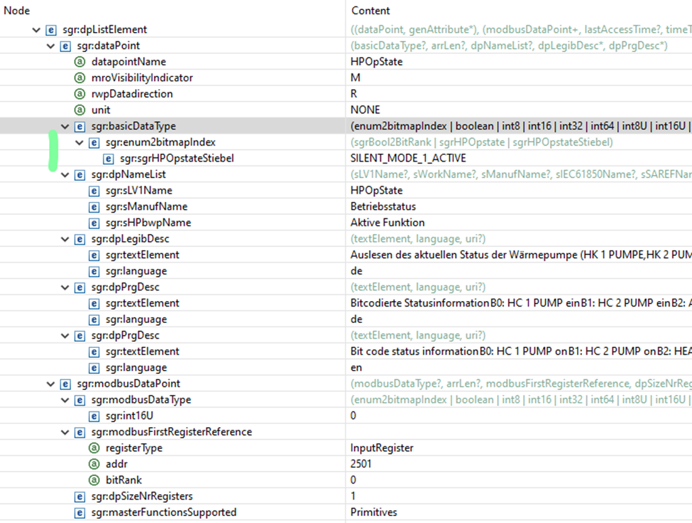

# Handling modbus-register based status-bits

## General description
Some devices such as heat pumps hold their status within bit-registers. To get access to a specific status bit-value 
the related status register must be read from the device. Then the bit-value can be determined by applying a bit mask.

## Definition of a status-bit register datapoint
The status-bit register is defined within the "sgr:basicDataTypeElement" as "sgr:enum2bitmapIndex" datatype.
(as a sibling of the other datatypes like int8, float32...)
It contains an enumeration type for a specific enumeration-value to bit-index mapping, in our case "sgr:sgrHPOpstateStiebel"
enumeration value "SILENT_MODE_ACTIVE_1".



The status bits are addressed by index. The index is determined by the order of the enumeration items within the 
XML-Schema. For example "sgr:sgrHPOpStateStiebel" in SGrGenTypeDefinitions.xsd:

```
    <restriction base="string">
      <enumeration value="HP_1_PUMP_ON" />
      <enumeration value="HP_2_PUMP_ON" />
      <enumeration value="HEATUP_PROGRAM" />
      <enumeration value="NHZ_STAGES_RUNNING" />
      <enumeration value="HP_IN_HEATING_MODE" />
      <enumeration value="HP_IN_DHW_MODE" />
      <enumeration value="COMPRESSOR_RUNNING" />
      <enumeration value="SUMMER_MODE_ACTIVE" />
      <enumeration value="COOLING_MODE_ACTIVE" />
      <enumeration value="MIN_ONE_IWS_IN_DEFROST_MODE" />
      <enumeration value="SILENT_MODE_1_ACTIVE" />
      <enumeration value="SILENT_MODE_2_ACTIVE" />
    </restriction>

```
Beginnint with HP_1_PUMP_ON=0, HP_2_PUMP_ON=1, HEAT_UP_PROGRAM=3 and so on....

## Usage in the communicator code
The evaluation of the status bits is done within

```
// Read the operation status register as a whole
int iVal=devStiebelISG.getValByGDPType("HeatPumpBase", "HPOpState").getInt16U();

// Use the status bit enumerations to determine the status-bits
if (iVal != 0)  
{
  System.out.printf("    HPOpState bits set: "); 
  if(( (iVal2 & (1<<SGrHPOpstateStiebelType.HP1PUMPON_VALUE))) != 0) System.out.printf("HP_1_ON, ");
  if(( (iVal2 & (1<<SGrHPOpstateStiebelType.HP2PUMPON_VALUE))) != 0) System.out.printf("HP_2_ON, ");
  if(( (iVal2 & (1<<SGrHPOpstateStiebelType.HPINDHWMODE_VALUE))) != 0) System.out.printf("DHW ON, ");
  if(( (iVal2 & (1<<SGrHPOpstateStiebelType.HPINHEATINGMODE_VALUE))) != 0) System.out.printf("HEAT ON, ");
  if(( (iVal2 & (1<<SGrHPOpstateStiebelType.COMPRESSORRUNNING_VALUE))) != 0) System.out.printf("Compressor ON, ");
  if(( (iVal2 & (1<<SGrHPOpstateStiebelType.COOLINGMODEACTIVE_VALUE))) != 0) System.out.printf("COOLING ON, ");
  if(( (iVal2 & (1<<SGrHPOpstateStiebelType.HEATUPPROGRAM_VALUE))) != 0) System.out.printf("HEAT PRORGRAMM, ");
  if(( (iVal2 & (1<<SGrHPOpstateStiebelType.NHZSTAGESRUNNING_VALUE))) != 0) System.out.printf("NHZ Stage ON, ");
  if(( (iVal2 & (1<<SGrHPOpstateStiebelType.MINONEIWSINDEFROSTMODE_VALUE))) != 0) System.out.printf("DEFROSTING, ");
  if(( (iVal2 & (1<<SGrHPOpstateStiebelType.SILENTMODE1ACTIVE_VALUE))) != 0) System.out.printf("Silent 1 Mode, ");
  if(( (iVal2 & (1<<SGrHPOpstateStiebelType.SILENTMODE2ACTIVE_VALUE))) != 0) System.out.printf("Silent 2 Mode (HP is off) ");
  System.out.printf("%n");
}
```
This wil print the following output to the console, depending on the status bits set within the status-register:
```
HPOpState bits set: HP_1_ON, HP_2_ON, HEAT ON, Compressor ON,
```

## SGrModbusDevice code

```
// Check if the data-type is a bitmap index
if (dGenType.getEnum2bitmapIndex()!=null)
{
    // Extract the status register as byte
    RegRes = ((long) Math.abs(mbregresp[0] &0xff));
    short shVal = (byte) Math.abs(RegRes);
    retVal.setInt8U(shVal);
    
    // Extract status register as 16bit unsigned int
    int iVal = (int) Math.abs(RegRes);
    retVal.setInt16U(iVal);
    if (size > 1) 
    {  // Extract status register as 32bit unsigned int 
       RegRes =  (((long) mbregresp[1])<<16) & ((long) 0xffff0000);
       RegRes = (long) Math.abs(RegRes + (long) mbregresp[0]);
       retVal.setInt32U(RegRes);
    }
    else
    {
        retVal.setInt32U((long) iVal);
    }
}
```
Rem: getEnum2bitmapIndexType does not make use of the enumeration values: The communicator code can use the mask 
given by the SGrHPOpstateStiebelType enumeration value (see code example in chapter 'Usage in the communicator code'
above). 


